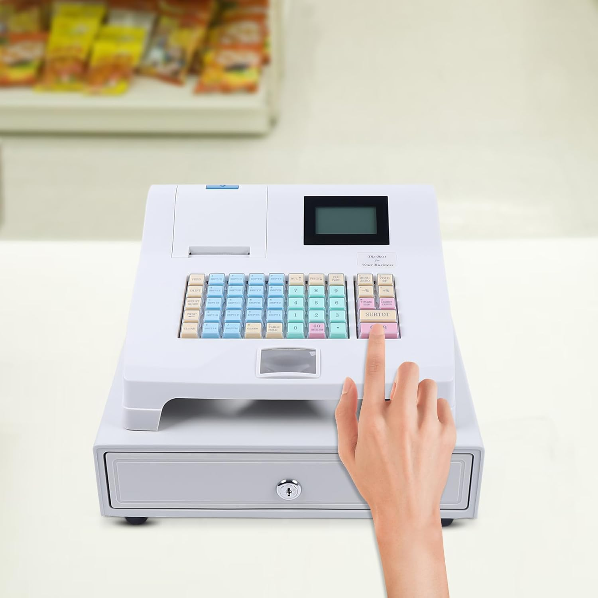

# 🏧 Caja Registradora - Proyecto Web



**Prueba en vivo:** [Ver en GitHub Pages](https://karinarojasdev.github.io/CashRegister/)

---

## 📌 Descripción

Este proyecto es una **simulación de caja registradora** desarrollada en **HTML, CSS y JavaScript**. Permite registrar el pago de un producto, calcular el cambio y mantener actualizado el **estado de la caja** con billetes y monedas disponibles.

El diseño es **responsivo**, con efectos de glow y colores neón para mejorar la experiencia visual, y permite ver de manera clara el cambio entregado al cliente y el inventario de billetes y monedas.

---

## ⚙ Cómo funciona

1. **Ingresar el precio del producto** en el campo correspondiente.
2. **Introducir los billetes y monedas** que entrega el cliente.
3. Presionar el botón **“Calcular Pago”**:
   - Se calcula el total pagado por el cliente.
   - Se entrega el cambio necesario utilizando los billetes y monedas disponibles en la caja.
   - Se actualiza automáticamente el inventario de la caja y se muestra en pantalla.
4. Presionar **“Limpiar”** para reiniciar los campos y poder realizar una nueva operación.

---

## 🧩 Características principales

- Cálculo automático de cambio según billetes y monedas disponibles.
- Actualización del estado de la caja en tiempo real.
- Efectos visuales modernos: glow en inputs y botones, transición suave.
- Layout responsivo: móvil, tablet y escritorio.
- Mensajes claros para pagos insuficientes, exactos o con cambio entregado.

---

## 🚀 Cómo usar este proyecto

### Clonarlo

```bash
git clone https://github.com/TU_USUARIO/TU_REPO.git
cd TU_REPO
```

### Abrirlo en local

1. Abrir el archivo `index.html` en tu navegador favorito.
2. Interactuar con la caja registradora ingresando precios y pagos.

### Probar en vivo

[Ver en GitHub Pages](https://karinarojasdev.github.io/CashRegister/)

---

## 🎨 Tecnologías utilizadas

- HTML5
- CSS3 (Flexbox, Grid, Media Queries, Variables CSS)
- JavaScript (ES6+, manejo de objetos y DOM)

---

## 📂 Estructura del proyecto

```
/caja-registradora
│
├─ index.html          # Página principal
├─ style.css           # Estilos de la web
├─ script.js           # Lógica de la caja registradora
└─ assets/
   └─ img
        └─ caja_registradora.jpg   # Imagen para el README
```

---

## 🤝 Contribuciones

Si deseas contribuir al proyecto:
1. Haz un fork del repositorio.
2. Crea una rama para tus cambios (`git checkout -b feature/nueva-funcionalidad`).
3. Realiza los cambios y haz commit (`git commit -m "Agrega nueva funcionalidad"`).
4. Envía tus cambios al repositorio principal con un pull request.

---

## 📧 Contacto

Cualquier duda o sugerencia, puedes contactarme en mi perfil de GitHub: [KarinaRojasDev](https://github.com/KarinaRojasDev)

